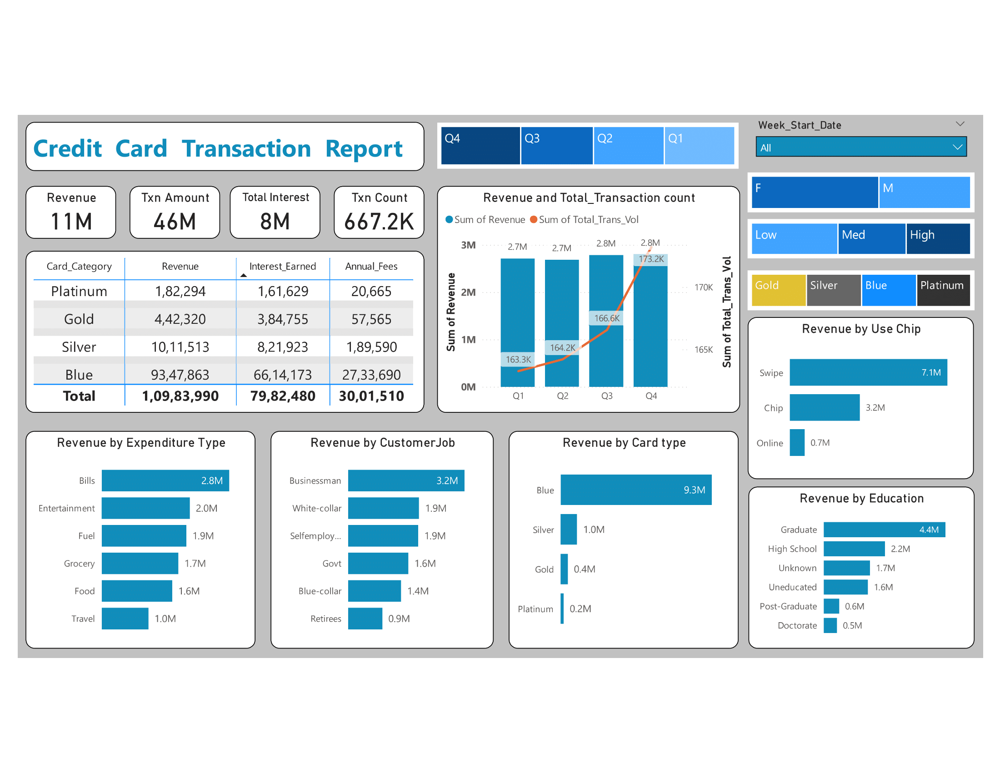
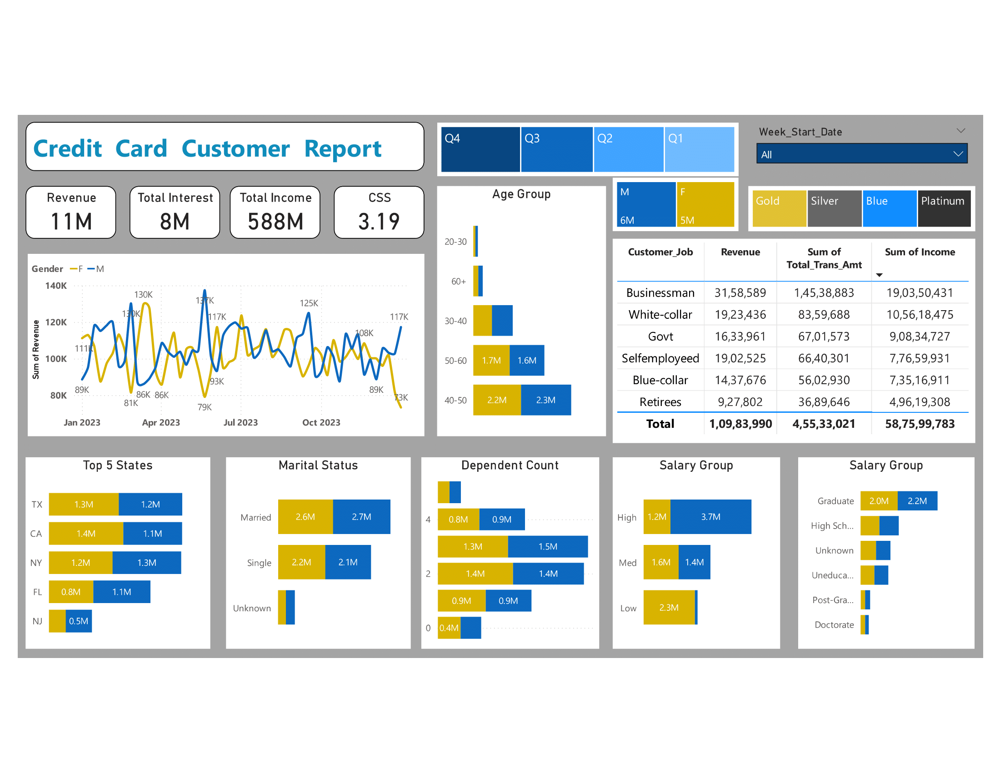

# 💳 Credit Card Dashboard – Power BI & Python Project

## 📌 Project Overview

This project presents an interactive **Credit Card Dashboard** built in **Power BI**, powered by a **MySQL database** and updated using **Python (Pandas)** for real-time data processing. It provides insights into customer behavior, transaction trends, and revenue performance for a credit card provider.

---

## 🧰 Tools & Technologies Used

- **Power BI** – Data visualization and reporting  
- **MySQL** – Database for storing and querying credit card data  
- **Python (Pandas)** – Data cleaning, transformation, and CSV import into MySQL  
- **DAX** – For creating calculated measures in Power BI  

---

## 🗃️ Data Handling

- Raw data was stored in CSV format.
- Used **Python and Pandas** to:
  - Clean and preprocess the data.
  - Load it into **MySQL database tables**.
  - Add a **new week of data** to simulate **real-time updates**.
- Power BI connects to the MySQL database to retrieve up-to-date data for dashboard visuals.

---

## 📊 Dashboard 1: Credit Card Transaction Report

This report gives a **financial and behavioral breakdown** of credit card usage.

### 🔑 Key KPIs:
- **Revenue**: ₹11M  
- **Transaction Amount**: ₹46M  
- **Total Interest**: ₹8M  
- **Transaction Count**: 667.2K  

### 📈 Visual Insights:
- Card Category Summary Table
- Revenue & Transaction Trends by Quarter
- Revenue Breakdown by:
  - Expenditure Type
  - Customer Job
  - Card Type
  - Use Method (Swipe, Chip, Online)
  - Education Level

---

## 📊 Dashboard 2: Credit Card Customer Report

This report analyzes **customer demographics**, income, and satisfaction.

### 🔑 Key KPIs:
- **Revenue**: ₹11M  
- **Total Interest**: ₹8M  
- **Total Income**: ₹588M  
- **CSS (Customer Satisfaction Score)**: 3.19  

### 📈 Visual Insights:
- Revenue Trend by Gender
- Revenue by Age Group, Job, State, Marital Status, Dependents, Salary, and Education

---

## ⚙️ How to Run This Project

1. **Run Python Script** to:
   - Load CSV into MySQL.
   - Append a new week's data to simulate real-time.
2. **Connect Power BI** to the MySQL database.
3. **Refresh Power BI visuals** to see updated metrics.

---

## 📂 Project Files

- `customer.csv`
- `credit_card.csv`
- `CC_Transaction.pbix`
- `Transaction_Dashboard.png`
- `Customer_Dashboard.png`

---

## 👨‍💻 Author

**Jatin Taori**  
Email: jatintaori100@gmail.com  
LinkedIn: [https://lik](https://www.linkedin.com/in/jatintaori1904/)

---

